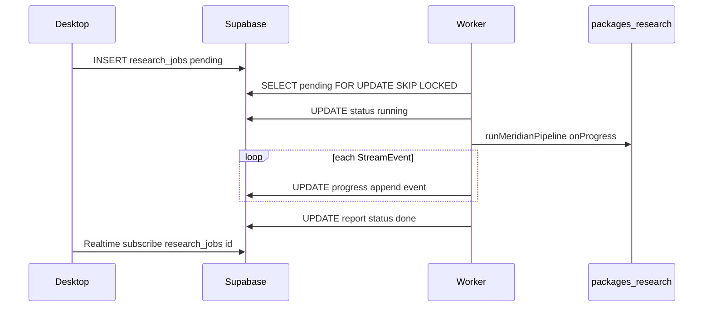

# Supabase Research Jobs — Phase 2 Contract

This document defines the database schema and Realtime contract for persisting Meridian AI research runs. **No migration is applied in Phase 1.**

## Table: `research_jobs`

```sql
create type research_job_status as enum ('pending', 'running', 'done', 'error');

create table research_jobs (
  id uuid primary key default gen_random_uuid(),
  user_id uuid not null references auth.users(id) on delete cascade,
  company text not null check (char_length(company) <= 100),
  ticker text,
  status research_job_status not null default 'pending',
  progress jsonb not null default '[]'::jsonb,
  report jsonb,
  error text,
  created_at timestamptz not null default now(),
  updated_at timestamptz not null default now()
);

create index research_jobs_user_id_idx on research_jobs(user_id);
create index research_jobs_status_idx on research_jobs(status) where status in ('pending', 'running');

alter table research_jobs enable row level security;

create policy "Users read own jobs"
  on research_jobs for select
  using (auth.uid() = user_id);

create policy "Users insert own jobs"
  on research_jobs for insert
  with check (auth.uid() = user_id);
```

## `progress` JSONB shape

Array of `StreamEvent` objects from `@meridian/research`, appended as the worker runs:

```json
[
  { "type": "phase", "phase": "market", "label": "Fetching market data" },
  { "type": "graph_node", "category": "Suppliers", "node": { } }
]
```

Alternatively, store only the latest event: `{ "type": "phase", "phase": "pass4", "label": "..." }`.

## `report` JSONB shape

Full `MeridianReport` object on `status = 'done'`.

## Worker flow (Phase 2)



## Realtime

Enable Realtime on `research_jobs`. Desktop subscribes:

```typescript
supabase
  .channel(`job:${jobId}`)
  .on("postgres_changes", { event: "UPDATE", schema: "public", table: "research_jobs", filter: `id=eq.${jobId}` }, handler)
  .subscribe();
```

## Security

- API keys (`OPENAI_API_KEY`, `PERPLEXITY_API_KEY`, `MASSIVE_API_KEY`) live **only** on the worker process
- Desktop uses Supabase anon key + RLS; never receives provider keys
- Rotate any keys that were exposed outside `.env`

## HTTP compatibility

Phase 1 worker routes remain the local dev surface:

- `POST /api/analyze/stream`
- `POST /api/analyze`
- `GET /api/openai/health`
- `GET /api/research/health`

Phase 2 worker can expose the same contract while persisting to Supabase.
